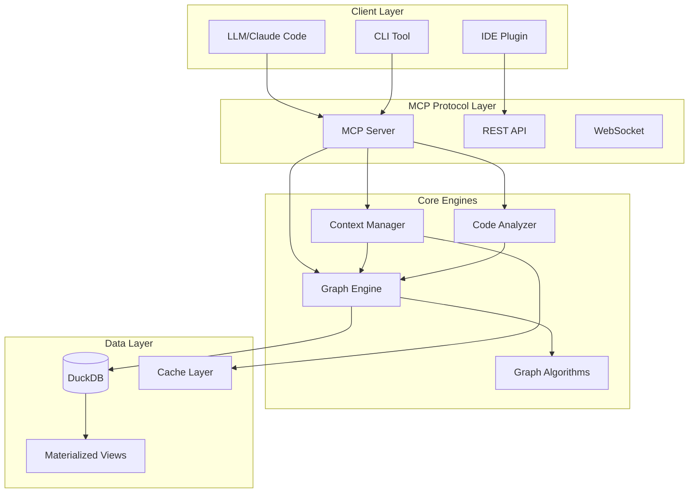

# System Architecture - LLM Memory Knowledge Graph

## High-Level Architecture



## Knowledge Graph Structure

```
                    PROJECT
                       |
          /------------+------------\
         /             |             \
      FILE           FILE           FILE
       |               |               |
    /--+--\        /--+--\        /--+--\
   /   |   \      /   |   \      /   |   \
ENTITY ENTITY  ENTITY ENTITY  ENTITY ENTITY

Edges: imports, calls, extends, implements, similar_to
```

## Data Flow

### 1. Context Retrieval Flow
```
User Query → MCP Server → Context Manager → Graph Engine → DuckDB
                                    ↓
                            Relevance Scoring
                                    ↓
                            Token Optimization
                                    ↓
                            Context Package → LLM
```

### 2. Code Analysis Flow
```
Source Files → Code Analyzer → AST Parsing → Entity Extraction
                                      ↓
                              Relationship Detection
                                      ↓
                              Graph Construction → DuckDB
```

### 3. Pattern Detection Flow
```
Graph Structure → Graph Algorithms → Pattern Matching
                          ↓
                  Community Detection
                          ↓
                  Anti-Pattern Detection
                          ↓
                  Issue Report → User
```

## Database Schema Overview

### Star Schema Design
```
                 FACT_INTERACTION
                /        |        \
               /         |         \
    DIM_SESSION    DIM_PROJECT    DIM_TASK
              \         |         /
               \        |        /
                FACT_UNDERSTANDING
                        |
                  FACT_METRICS
```

### Knowledge Graph Tables
```
Node Tables:
├── node_project     (root level)
├── node_file        (project children)
├── node_entity      (file children)
└── node_concept     (abstract patterns)

Edge Tables:
├── edge_relationship (all relationships)
└── edge_fast_lookup  (optimized traversal)

Fact Tables:
├── fact_interaction     (LLM interactions)
├── fact_understanding   (code comprehension)
└── fact_graph_metrics   (graph statistics)
```

## Scalability Architecture

### Small Scale (<1K files)
```
Single Process
     ↓
In-Memory Graph
     ↓
Direct Queries
```

### Medium Scale (1K-100K files)
```
Multi-threaded Processing
         ↓
Materialized Views
         ↓
Cached Contexts
         ↓
Sampled Algorithms
```

### Large Scale (>100K files)
```
Distributed Analysis
         ↓
Partitioned Graphs
         ↓
Hierarchical Aggregation
         ↓
Approximate Algorithms
```

## Performance Optimizations

### 1. Query Optimization
- **Indexes**: On frequently accessed columns
- **Materialized Views**: Pre-computed common queries
- **Partitioning**: By project_id for multi-tenant

### 2. Graph Traversal
- **Fast Lookup Table**: Direct edge access
- **Recursive CTEs**: Efficient path finding
- **Sampling**: For expensive algorithms

### 3. Context Management
- **Relevance Decay**: Automatic score adjustment
- **Token Budgeting**: Smart compression
- **Priority Queues**: Most relevant first

## Security Architecture

### Access Control
```
User → Authentication → Authorization → Project Access
                              ↓
                     Row-Level Security
                              ↓
                     Filtered Context
```

### Data Protection
- Encrypted at rest (optional)
- No sensitive data in logs
- Sanitized file paths
- User isolation

## Integration Points

### MCP Protocol
```json
{
  "method": "getContext",
  "params": {
    "project_id": 1,
    "max_tokens": 4000,
    "focus_files": ["main.py"]
  }
}
```

### REST API
```
GET  /projects/{id}/context
POST /projects/{id}/analyze
GET  /projects/{id}/dependencies
GET  /projects/{id}/issues
POST /interactions
```

### WebSocket Events
```
connect → authenticate → subscribe(project)
         ↓
    file_changed
    analysis_complete
    context_updated
    issue_detected
```

## Monitoring & Observability

### Key Metrics
```
System Metrics:
├── Query latency (p50, p95, p99)
├── Context generation time
├── Graph traversal depth
├── Memory usage
└── Database size

Business Metrics:
├── Projects tracked
├── Understanding progression
├── Patterns detected
├── Context efficiency (tokens saved)
└── User satisfaction
```

### Health Checks
```
/health
  ├── database_connection
  ├── memory_available
  ├── disk_space
  └── response_time
```

## Deployment Architecture

### Docker Deployment
```dockerfile
FROM python:3.11-slim
COPY . /app
WORKDIR /app
RUN pip install -r requirements.txt
CMD ["python", "mcp_server.py"]
```

### Kubernetes Deployment
```yaml
apiVersion: apps/v1
kind: Deployment
metadata:
  name: llm-memory
spec:
  replicas: 3
  template:
    spec:
      containers:
      - name: mcp-server
        image: llm-memory:latest
        resources:
          requests:
            memory: "4Gi"
            cpu: "2"
```

## Future Architecture Considerations

### 1. Distributed Processing
- Apache Spark for large-scale analysis
- Ray for distributed graph algorithms
- Kubernetes for horizontal scaling

### 2. Enhanced Storage
- PostgreSQL with graph extensions
- Neo4j for native graph operations
- Vector database for embeddings

### 3. Real-time Updates
- Kafka for event streaming
- Redis for real-time cache
- WebSocket for live updates

### 4. AI Enhancement
- Embedding models for semantic search
- LLM for automatic summarization
- ML for pattern prediction

## Conclusion

This architecture provides:
- **Scalability**: Handles projects from 10 to 10M files
- **Performance**: Sub-second context retrieval
- **Reliability**: Persistent, crash-resistant storage
- **Extensibility**: Plugin architecture for new features
- **Compatibility**: Standard MCP protocol support